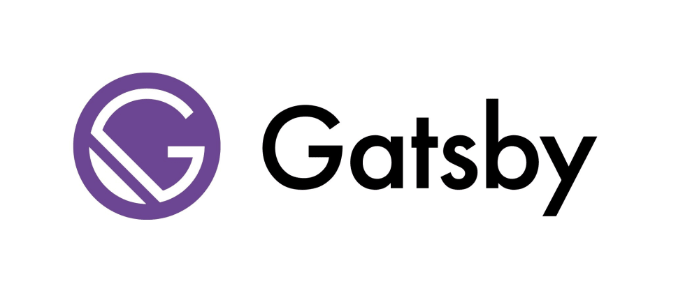
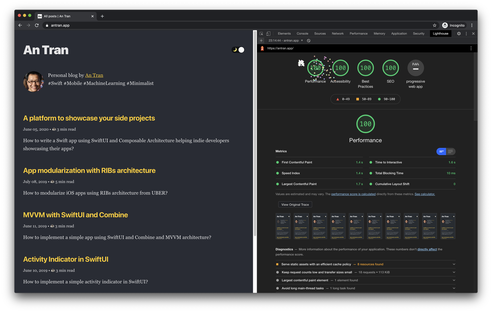
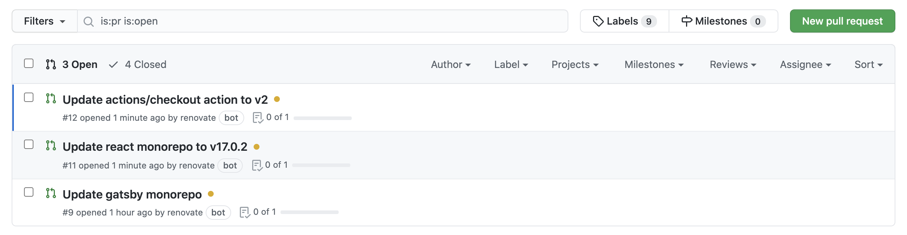
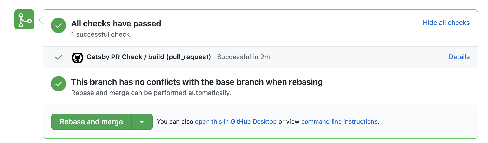

In the previous articles, I have discussed [why you should start a technical blog](https://antran.app/2021/minimal-technical-blogging-part1/) and [which options you have to kickstart such a blog](https://antran.app/2021/minimal-technical-blogging-part2/).

There are pros and cons to each option. Depending on how much experience you have had in blogging, how much time you want to invest in setting up/maintaining the infrastructure for your blog as well as how much money you are willing to pay for hosting, you should choose a appropriated approach.

Since I'm owning [my desired custom domain](https://antran.app) already, and as a minimalist, I just want to have a very minimal, low-cost setup to start writing, I have opted in the approach of using a static site generator to generate static pages for my blog and I'm hosting it using Github Pages which is free for both hosting and custom domain support.

In this article, I will give you a walk-through of my setup and show you how you can set up a similar blog in 2 minutes.

## What is a Static Site Generator?

I copied the definition shamelessly from [the Gatsby's website](https://www.gatsbyjs.com/docs/glossary/static-site-generator/).

> A static site generator is a software application that creates HTML pages from > templates or components and a given content source. Most static site generators, including Gatsby, accept Markdown-formatted text files as a source, although Gatsby is not limited to Markdown.

[Gatsby](https://www.gatsbyjs.com/) is one of the many [Static Site Generators](https://jamstack.org/generators/) available.

Although GitHub Pages supports [Jekyll](https://jekyllrb.com/), another popular static site generator, natively and has a lot of built-in workflows to support it, I have chosen Gatbyjs because of the quite obvious reason:

- Jekyll is written in Ruby, which I don't like to learn.
- Gatsby is written in Javascript, using Reactjs under the hood, which is something I want to learn.

## Gatsby

Gatsby can be used to build static sites that are Progressive Web Apps, follow the latest web standards, and are optimized to be highly performant. It makes use of the latest and popular technologies including ReactJS, Webpack, GraphQL, modern ES6+ JavaScript, and CSS.

There are quite many features supported by Gatsby out-of-the-box:
- **Components:** you can (re)use React components in your Gatsby application.
- **Webpack bundling and latest tooling:** helps creates optimized, minified bundles of HTML, JavaScript, and CSS. When it’s pre-configured with Babel and more plugins, it allows you to use the latest ES6+ JavaScript and GraphQL.
- **Plugins, Starters, React packages:** You can use any of the packages you’ve already been using with NPM, particularly the React ones as it’s built on the same thing. But that’s not all: there’s a large number of ever-growing plugins, starters, and transformers by the Gatsby community.
- **Flexible Styling / Theming:** Gatsby has support for SCSS, CSS-in-JavaScript libraries, allowing you to manage styles better and with ease. Even the setup for this is fairly easy to handle with the installation of a plugin or package. Gatsby also has a [concept of theme shadowing](https://www.gatsbyjs.com/docs/how-to/plugins-and-themes/shadowing/), which can enhance any existing installation with custom styling rules.
- **Responsive Images:** there is [official plugin](https://www.gatsbyjs.com/plugins/gatsby-plugin-sharp/) which can directly generate fluid images, add filters, change formats, blur up on load and a lot more.
- **App-like experience:** many default configurations to support PWA, offline caching etc..

I recommend you to take a look at [the high-level explanations](https://www.gatsbyjs.com/docs/conceptual/) of Gatsby to understand more about its design philosophy.

## GitHub Pages

[GitHub Pages](https://pages.github.com/) is a static site hosting services provided for free by Github, which has many advanced features:

- Custom domain supported
- Free SSL Certificate
- Many automation flows to deploy using git.

## Setup

### Gatsby

These are the steps to install and enhance the Starter package using plugins and my own customizations:

- Install [the official Blog Starter package](https://github.com/gatsbyjs/gatsby-starter-blog)
- Add reading time
- Add Tags
- Add Category
- Add Pagination
- Add Table of Contents
- Add RSS
- Add Light/Dark mode toggle
- Add Translation:
- Add Table of Contents

I'm not going to explain in detail those steps. I'll publish the source code of my blog as a starter package soon for you to take a look at soon.

The design is very much inspired by [Overreacted.io](https://overreacted.io/) from [Dan Abramov](https://twitter.com/dan_abramov), which is [open-source](https://github.com/gaearon/overreacted.io) as well but running Gatsby 2.0.

### Lightning fast

The main advantage of static site generated with Gatsby is that it is lightning fast. My website has scored 100 points in Lighthouse test.

### Automated Tests

Since I plan to automate my blog deployment using GitHub Actions, I have written some tests to ensure that any change to my setup will not break my blogging site. 

These are tests that I wrote using [Cypress](https://www.cypress.io/):

- Ensure the blog index page is generated and rendered
- Ensure the blog detail page is generated and rendered
- Ensure the RSS feeds are generated
- Ensure the sitemap file is generated

### Automated deployment with GitHub Actions

GitHub Actions is a free CI/CD work flow provided by GitHub. I raise pull requests everytime I change any thing in the setup or when write a new blog post. GitHub Actions will kick in and ensure that all the tests pass before letting me merging the pull request into `master` branch.

### Keeping dependencies up-to-date

One thing that I don't like when doing Javascript project is the number of dependencies that you need to install. Thankfully, there are many tools to help to keep the dependencies managable and up-to-date.

I'm currently using [Renovate Bot](https://github.com/renovatebot/renovate), which will scan and update the dependencies in my repository automatically. 

The bot will create a new pull request to suggest me to update any new dependencies when they are available. 

Thanks to the automated tests, I'm quite confident in updating those dependencies since the tests will ensure that everything is still working fine.

## Conclusion

In this article, I have described shortly my minimal setup for my blogging site with some of the features that I'm quite happy with:
- Using Gatsby to generate a static site from Markdown content. 
- Having automated tests to ensure the site is working E2E.
- Deployed automatically using GitHub Actions.

All I need to do is writing, which is actually the hardest part of keeping your blog alive.

In the [next article](https://antran.app/2021/minimal-technical-blogging-part4/), I'll show you the open source starter package containing all customizations I have, so that you can kick start a similar project for your blog easily.

Photo by [Daniel Thomas](https://unsplash.com/@saltnstreets) on [Unsplash](https://unsplash.com/s/photos/computer-writing)
