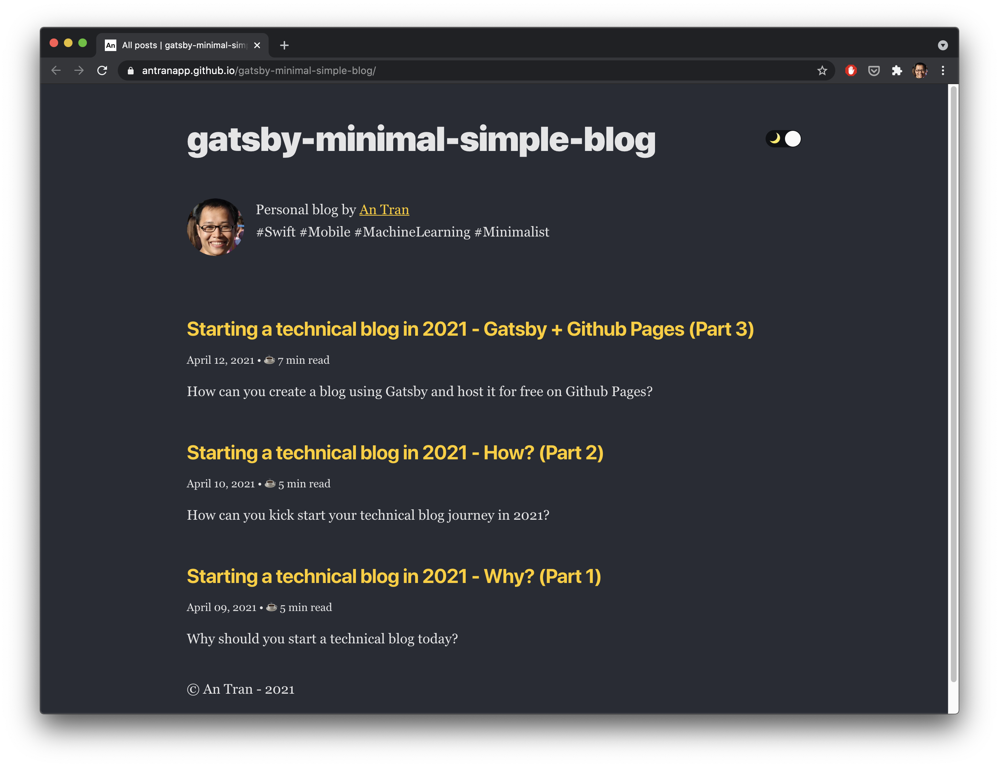

In the [last article](https://antran.app/2021/minimal-technical-blogging-part3/) in the series, I have introduced you to my minimal blogging setup using Gatsby and Github Pages: 

- Using **[Gatsbyjs](https://www.gatsbyjs.com/)** as a static site generator, we can easily create a static site for our Markdown content. The generated site is highly customizable, easily extensible, and fast.

- Using **[Github Pages](https://pages.github.com/)**, we can host the generated site for FREE on Github infrastructure.

- Using **[Github Actions](https://github.com/features/actions)** automation, we can deploy our site automatically from Github. With **[Renovate bot](https://www.whitesourcesoftware.com/free-developer-tools/renovate)** integration, we keep dependencies up-to-date automatically as well.

In this article, I'll introduce you to the [gatsby-minimal-simple-blog](https://github.com/antranapp/gatsby-minimal-simple-blog) package, which is the bare-bone package containing all customizations I have for my blog.

## What is a starter library?

A starter library is a basic boilerplate package to kick start a Gatsby project. 

When you first install Gatsbyjs, you normally install the [gatsby-blog-starter](https://github.com/gatsbyjs/gatsby-starter-blog) to have a bare-bone template for your project.

There are [many other starter libaries](https://www.gatsbyjs.com/starters/) available, containing different sets of customizations, and suitable for different purposes.

To enable other people to be able to create a similar blogging site as mine, I have extracted all customizations I have for my blog into the [gatsby-minimal-simple-blog](https://github.com/antranapp/gatsby-minimal-simple-blog) package. Everyone can easily use this library to kick off a new project with this template. This starter ships with all customizations I have for [my blog](https://antran.app).

## What included?

- Blazing fast, minimal template
- Design inspired by [Overreacted.io](https://overreacted.io)
- Support for an RSS feed
- Automatic optimization of images in Markdown posts
- Support for code syntax highlighting
- Includes plugins for easy, beautiful typography
- Includes React Helmet to allow editing site meta tags
- Includes plugins for offline support out of the box 
- Table of content

## How to use?

Just follow the `README.md` in [the project repository](https://github.com/antranapp/gatsby-minimal-simple-blog).

## Future development

I want to keep this starter as minimal as possible. But if you have any ideas to improve the template, feel free to open issues, pull requests at [the repository](https://github.com/antranapp/gatsby-minimal-simple-blog).